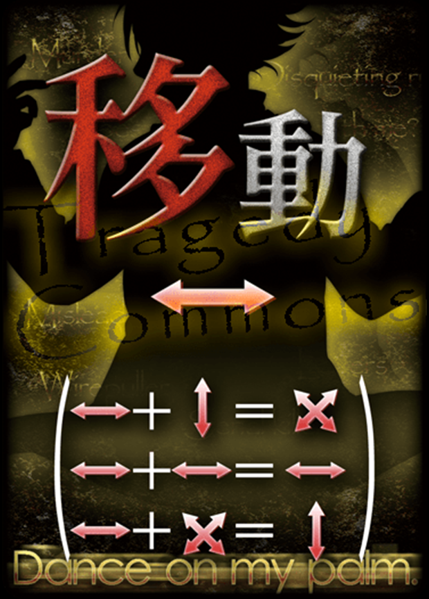

惨剧轮回是1个**主谋**（Mastermind，有时译为剧作家）和3个**主角**（Protagonists）之间的对抗桌游。

> 主角们发现自己所在的世界因为发生了惨剧而在不停地重置，但主角能保留轮回间的记忆。主角的目标是有限的轮回中找出惨剧发生的原因，并在任何一次轮回阻止它发生。

> 主谋策划了预定的惨剧并且早已探查好了所有相关的信息，他唯一不能预测的是正在轮回的主角的行动。主谋需要在有限的轮回中每一次都引发惨剧。

## 地点

惨剧的舞台由四个**地点**（Location）组成：

<table>
<tr><td>医院</td><td>神社</td></tr>
<tr><td>城市</td><td>学校</td></tr>
</table>

雏见泽.jpg

主角和主谋并不出现在地图上，但他们在每个轮回的每一天都会在这些地点间奔走来控制和影响角色（NPC）。

## 角色

**角色**（Character）是出现在地图上的人物，例如巫女、医生、职员。角色在任何时间都存在于某个地点。主角和主谋都要和登场的角色互动来阻止/引发惨剧。大部分角色都有友好能力，在他们对主角的好感度足够之后可以被主角启动，帮助主角阻止密谋或收集信息。同时，每个角色还会有且仅有一个幕后的**身份**（Role），例如，巫女可能是一个死亡就会导致惨剧发生从而世界重置的关键人物。每个角色拥有什么身份是仅有主谋知道的非公开信息。

## 指示物

指示物可能存在于角色或地点上，用于计量各种数值。主要有三种指示物：

- **友好**（Goodwill，有时译为好感）指示物：主要由玩家放在角色上。友好指示物达到一定数量之后，玩家就可以启动角色的友好能力。
- **不安**（Paranoia）指示物：玩家和主谋都可以放置在角色上。不安指示物达到一定数量之后，角色可能引发事件。
- **密谋**（Intrigue，有时译为阴谋）指示物：主要由主谋放在角色**和地点**上。没有默认的用途，但有很多能力和效果关心密谋指示物的数量。

地点上只能放置密谋指示物。

## 角色卡

古手梨花.jpg

角色卡上的信息包括：

- （左上角）不安临界2：当角色的不安指示物数量大于或等于角色的不安临界时，角色可能引发事件（见下）。
- （右上角）起始地点（神社）、禁入地点（城市）：起始地点是每个轮回开始时角色所在的地点；禁入地点是角色不能进入的地点。

- （右上角）标签（学生、少女）：一些效果和规则会关心角色的标签。
- （下边）友好能力：一个角色的好感指示物数量如果大于等于一条能力左侧的心形数量，主角就能启动这条能力。每条友好能力每天只能启动一次，但可以同一天启动同一个角色的多条不同的友好能力。右侧标记了1/L（每轮回一次）的能力每轮回只能启动一次。

一个角色死亡后，角色卡会被横置。她不再是一个角色而是一个尸体，她的任何能力都不能启动，指定角色为目标的能力也不能以她为目标。她不再具有任何标签。但她上面的所有指示物都不会移除，也不能再在尸体上放置或移除任何指示物。角色死亡和主角的失败没有直接关系，所有角色都死亡了主角也可以胜利。

## 行动牌

主角和主谋主要通过使用行动牌来影响角色和地点。主谋有这些行动牌：

- 横向移动
- 纵向移动
- 斜向移动（每轮回一次）
- 禁止友好
- 禁止不安
- 不安+1
- 不安+1
- 不安-1
- 密谋+2（每轮回一次）
- 密谋+1

每个主角都有一组这些行动牌：

- 禁止移动（每轮回一次）
- 横向移动
- 纵向移动
- 友好+2（每轮回一次）
- 友好+1
- 不安+1
- 不安-1（每轮回一次）
- 禁止密谋*

> \*：这张牌有特殊规则，并不完全是字面意思，见下文行动牌结算

在每天，主谋从所有行动牌里面选择3张背面朝上放在3个**不同**的人物或地点上。随后，每个主角各从自己的所有行动牌里选择1张背面朝上放在1个人物或地点上，所有被主角放置了行动牌的3个人物或地点也需要**不同**。因此，每个人物或地点每天最多有两张行动牌，一张由主角放置，一张由主谋放置。

从主谋开始放置行动牌，到所有主角都放置完行动牌的这段时间，主角不能进行任何讨论。主角可以在其余可以讨论的时间讨论和约定放置行动牌的策略甚至是具体放置什么行动牌、甚至分类讨论主谋放置行动牌的位置来决定不同的方案，但所有讨论内容都必须让主谋听到。

大部分行动牌不会被消耗，在每天都可以使用，除了标记了每轮回一次的行动牌每轮回只能使用一次。主角的每轮回一次的行动牌每个主角各可以使用一次。

> 后放置行动牌的主角能看到之前其他主角放置行动牌的位置，但看不到内容。理论上，三个主角放置行动牌的顺序是固定并且每天轮换的，但这个顺序几乎没有意义并且会凭空多出很多等待其它玩家思考的时间，笑笑平常一直采用房规“三个主角可以以任何顺序放置这三张行动牌”。

所有6张行动牌被放好后，将它们同时翻开并按照下面的顺序结算：

- 禁止移动牌：如果一个角色上放置了禁止移动，这一天这个角色不会因为其它行动牌移动（但还可能因为任何别的原因移动）。放在地点上的禁止移动牌没有效果。

- 移动牌：如果一个角色上只放置了一张移动牌，按照那张移动牌的方向移动（例如，横向移动会把神社的角色移动到医院，把医院的角色移动到神社，等等）。如果一个角色上放置了两个相同的移动，这个角色仅按照这个方向移动一次。如果一个角色上放置了两个不同的移动，计算两个移动的和（例如，一个横向移动和一个纵向移动会合成斜向移动；一个横向移动和一个斜向移动会合成纵向移动），然后该角色仅按照和的方向移动一次。放在地点上的移动牌没有效果。

移动合成公式.jpg

> 因此，即使一个在神社的角色被禁止进入学校和医院，一个横向移动和一个纵向移动还是能把她直接移动到城市。

> tips：主角方总是能确保一个角色在某天不移动。对于一个没有禁入地点的角色，主角方也总是能确保她在某天一定会移动。反之，主谋总是能确保她永远无法到达某个她现在不在的地点。

- 禁止（某指示物）牌：如果一个角色或地点上放置了禁止（某指示物），这一天这个角色或地点上的这种指示物数量不会因为其它行动牌改变（但还可能因为其它任何别的原因改变）。唯一的例外是主角的禁止密谋牌：如果主角在同一天放置了超过一张禁止密谋，所有的禁止密谋都会不起作用。

> tips：为了防止禁止密谋被队友抵消而直接崩盘，主角一般约定，除非第一个放牌的主角放的明显不是禁止密谋（这意味着他忘记了这个约定，或故意不遵守这个约定以达成更酷的协作），否则后续其它主角不要放禁止密谋。但后续其它主角不应该自动假设第一个放牌的主角放的就是禁止密谋。或反过来说，只有第一个放牌的主角负责决定这一天要不要放禁止密谋和决定往哪里放禁止密谋。

- 增加（某指示物）牌：增加对应的指示物到对应的角色或地点。地点只能获得密谋指示物，永远不能获得友好和不安指示物。

> 但不安+1甚至移动牌仍然可以被放在地点上，来伪装成可能的其它牌。

- 减少（某指示物）牌：给对应的角色或地点减少对应的指示物。

## 剧本

每局游戏都有一个独特的**剧本**。剧本是游戏出版商或社区按照一个统一的规则创建的，剧本的创作规则对主角是公开信息，但创建剧本过程中做出的选项大部分是非公开信息。主谋知道剧本的所有信息。

> 剧本的创作者和主谋不是同一阵营的。很容易就能创建出符合规则并且主谋一定能获胜的剧本，但创作者目的是创作出主谋和主角双方平衡的剧本。这一点甚至可以帮助推理。

为了避免剧透，笑笑不能在这里展示一个具体的剧本，但一个剧本包括以下元素：

- 名称和背景故事。这是非公开信息。即使只是剧本名称也可能含有帮助主角推理的剧透，在完成游戏之前不要让主角知道。

- 轮回数和每轮回的天数。这是公开信息。

例如，新手教程E-FS-1的轮回数是3，每轮回天数是4。

> 这里E代表英版（这个游戏日版->英版->中版每次再版剧本都经过修订，所以不完全一样），FS是剧本集（见下），1是剧本编号。我们玩的是英版剧本（因为资源比较好找）。

- 登场角色列表和每个角色的身份。这是非公开信息，但在新手教程里角色列表是公开信息。即使在正常游戏中，第一轮回的第一天游戏设置好后主角也能知道大部分登场角色。

例如，新手教程E-FS-1的角色列表是男学生、女学生、巫女、警官、职员、医生。

- 主要剧情（Main Plot，有时译为规则Y）和次要剧情（Subplot，有时译为规则X）。一个剧本由1个主要剧情和2个不同的次要剧情组成，但新手教程只由1个主要剧情和1个次要剧情组成。创作剧本时，主要剧情和次要剧情的可选列表是公开信息，但具体选择了哪个主要剧情和次要剧情是非公开信息。  
每个剧情都会提供一定数量的**身份**，这些身份要被分配给登场角色，每个角色也只能被分配到一个身份。每个剧情提供的所有身份都必须被分配，也只有这些身份能被分配。有些剧情还会提供特殊规则，例如主谋可以使用的能力。一般来说，主要剧情提供主谋的胜利方式，次要剧情提供辅助主谋获胜的其它资源。

新手教程的主要剧情和次要剧情可选列表如下：

<table>
<tr><th>主要剧情</th><th>关键人物</th><th>杀手</th><th>幕后黑手</th><th>邪教徒</th><th>特殊规则</th></tr>
<tr><td>谋杀计划</td><td>1</td><td>1</td><td>1</td><td></td><td></td></tr>
<tr><td>复仇之光</td><td></td><td></td><td>1</td><td></td><td>[强制] 轮回结束时，如果幕后黑手的起始地点有至少2个密谋指示物，主角失败。</td></tr>
<tr><td>守护此地</td><td>1</td><td></td><td></td><td>1</td><td>[强制] 轮回结束时，如果学校有至少2个密谋指示物，主角失败。</td></tr>
</table>

<table>
<tr><th>次要剧情</th><th>传谣者</th><th>连环杀手</th><th>暴脾气</th><th>密友</th><th>特殊规则</th></tr>
<tr><td>开膛手之影</td><td>1</td><td>1</td><td></td><td></td><td></td></tr>
<tr><td>不安传言</td><td>1</td><td></td><td></td><td></td><td>[可选][主谋能力][每轮回一次] 将一个密谋指示物放在任意地点。</td></tr>
<tr><td>幽默手稿</td><td>1</td><td></td><td>0-2</td><td>1</td><td></td></tr>
</table>

例如，新手教程中一定有一个角色的身份是传谣者，但只有主谋知道谁是传谣者。

- 剧本的剧本集，它提供了主要剧情和次要剧情的可选列表，并且经常被复用以创建多个不同的剧本。这是公开信息。

- 事件（Incident）列表、每个事件发生的天数和每个事件的肇事者（某个登场角色）。事件列表和每个事件发生的天数是公开信息，但事件的肇事者是非公开信息。每个事件都一定有肇事者，每个角色最多是一个事件的肇事者。在对应的天数结束前，如果当天事件的肇事者上的不安指示物数量大于或等于肇事者的不安临界（并且她还活着），事件会发生。只要不安指示物足够，事件就一定会发生（而非由主谋决定是否发生），但主谋为事件做出所有选择。事件是否发生是公开信息，即使它没有产生任何效果。

例如，新手教程E-FS-1的事件列表和每个事件发生的天数如下：

<table>
<tr><th>天数</th><th>事件</th><th>事件描述</th></tr>
<tr><td>1</td><td></td><td></td></tr>
<tr><td>2</td><td>谋杀</td><td>与肇事者在同一地点的另一个角色死亡。</td></tr>
<tr><td>3</td><td>自杀</td><td>肇事者死亡。</td></tr>
<tr><td>4</td><td></td><td></td></tr>
</table>

> 主谋额外知道谋杀的肇事者，例如巫女。那么当第二天结束前，如果巫女的不安指示物数量大于或等于2个，谋杀就会发生。如果巫女和男学生在同一地点，主谋可以决定杀死男学生（如果巫女只和男学生在同一地点，主谋必须杀死男学生），主角会得知“谋杀发生了，男学生死亡了”，但并不会直接得知巫女是肇事者。如果巫女单独处于一个地点，主角会得知“谋杀发生了，但是无事发生”。

## 身份、主谋能力和友好拒绝

每个角色都有一个**身份**（Role）。角色的身份是由剧本中的剧情分配的，不会凭空出现，除了剧本的创作者可以额外加入任意数量的剧情身份之外的角色，这些角色的身份是路人，没有任何能力。或者说，剧本的创作者先决定登场角色的列表和剧情，然后分配剧情需要的身份，没有被分配到身份的角色的身份都是路人。

一个身份可能有数量限制。这不意味着剧情的选取必须遵循这个限制，而是如果剧情的选取导致这个身份的数量超过这个限制，多余的身份不会也不能被分配。这条规则在新手教程里无关，因为新手教程的剧本集无论怎么选剧情都没法超过限制。

一些身份（例如幕后黑手、传谣者）有主谋能力，它们可以在结算行动牌后被主谋启动。一些身份（例如杀手）的能力在其它时间启动，但仍然由主谋来决定是否启动和如何启动。有身份（例如连环杀手）的能力连主谋也无法控制，但只有主谋知道这些身份，因此主谋也需要负责结算这些能力，并且如果有选择，为它们做出选择。

每条主谋能力每天只能启动一次，但可以同一天启动同一个角色的多条不同的主谋能力。标记了[每轮回一次]的能力每轮回只能启动一次。

一些身份有可选友好拒绝和强制友好拒绝。当主角启动一个其身份有可选友好拒绝的角色的友好能力时，主谋可以拒绝这次启动，如果有强制友好拒绝则必须拒绝。在启动友好能力时，主角先为能力决定所有选择（例如目标），然后主谋决定是否要拒绝。友好能力有没有被拒绝是公开信息（即使友好能力在没被拒绝时不会产生任何效果，主谋也要决定是否拒绝并告知主角）。

例如，新手教程里有这些可能的身份。

<table>
<tr><th>身份</th><th>数量限制</th><th>友好拒绝</th><th>能力</th></tr>
<tr><td>关键人物</td><td></td><td></td><td>[强制] 这个角色死亡时，主角失败，轮回立即结束。</td></tr>
<tr><td>杀手</td><td></td><td>可选</td><td>[可选][每天结束] 如果同一地点有一个至少有2个密谋指示物的关键人物，这个关键人物死亡。 [可选][每天结束] 如果这个角色有至少4个密谋指示物，主角死亡。</td></tr>
<tr><td>幕后黑手</td><td></td><td>可选</td><td>[可选][主谋能力] 将1个密谋指示物放在所在地点，或同一地点的一个角色上。</td></tr>
<tr><td>邪教徒</td><td></td><td>强制</td><td>[可选] 忽略所在地点或所在地点人物上放置的禁止密谋行动牌。</td></tr>
<tr><td>传谣者</td><td>1</td><td></td><td>[可选][主谋能力] 将1个不安指示物放在同一地点的一个角色上。</td></tr>
<tr><td>连环杀手</td><td></td><td></td><td>[强制][每天结束] 如果这个角色和恰好一个其它角色处于同一地点，那个角色死亡。</td></tr>
<tr><td>暴脾气</td><td></td><td>可选</td><td></td></tr>
<tr><td>密友</td><td>2</td><td></td><td>[强制][轮回结束] 如果这个角色死亡，揭示其身份，主角失败。 [强制][轮回开始] 如果这个角色的身份曾在任何轮回被揭示过，这个角色获得1个好感指示物。</td></tr>
</table>

主谋启动主谋能力，甚至结算强制能力时无需告知任何原因，只需要汇报结果，而如果结果没有导致任何可见的变化，主谋什么都不汇报。但当前是哪个阶段以及同一阶段内游戏状态变化发生的顺序总是公开信息。
> 例如，主谋能力阶段，主谋启动了幕后黑手巫女的能力给神社放置了一个密谋指示物，主角只会得知“神社不知道为什么获得了一个密谋指示物”，这可能是因为幕后黑手也可能是因为次要剧情不安传言的特殊规则。
> 
> 例如，某轮回的最后一天结束时，巫女和和有2个密谋指示物的男学生单独呆在神社，主谋启动了杀手巫女的能力杀死了关键人物男学生，主角只会得知“男学生不知道为什么死掉了，然后不知道为什么主角失败了，然后不知道为什么轮回结束了”，这可能是杀手或连环杀手杀死了男学生，但主角总是能根据自己在最后一天结束时失败了（而非轮回结束时，这是和轮回最后一天结束时不同的阶段）推理出男学生是关键人物。  

“主角死亡”是一种特殊的主谋获胜的方式，它等效于“主角失败，轮回立即结束”。主角失败和轮回立即结束这两件事本身的发生都是公开信息，但额外地，主角死亡的发生也是公开信息。因此主角死亡时，主角能得知主角死亡了，而不是仅得知“不知道为什么主角失败了，然后不知道为什么轮回结束了”。

## 胜利条件和最终猜测

如果任何一个轮回结束之后，主谋没能在这个轮回中宣告主角失败，主角直接获得最终胜利。

如果主角在每个轮回都失败了，在最后一个轮回结束后，主角还有最后一次获胜的机会——为每个登场角色猜测她的身份。如果猜测完全正确，主角获得最终胜利，否则主谋获得最终胜利。

但是因为新手教程的剧本规模太小了所以没有这个环节，如果主角在每个轮回都失败了，主谋直接获得最终胜利。

> 主角无需猜测每个事件的肇事者，尽管知道这些信息对帮助主角获胜也同样重要。

## 详细游戏流程

所有禁止讨论的阶段会被打上[禁止讨论]标签，基本上来说这只包括主谋放牌后主角放牌前的博弈阶段。除此之外的阶段主角可以随意推理和讨论，但所有讨论内容都必须被主谋听到。

整个游戏按以下流程进行：

- 公开剧本中的公开信息
- 进行轮回，直到主角在某一轮回获胜或进行完最后一个轮回
- 重新设置版图并进行最终猜测（如果有）

每个轮回的流程：

- [禁止讨论] 按照登场角色列表重新设置版图
- [禁止讨论] 轮回开始时：主谋启动或结算相关能力
- 依次进行轮回中的天数，直到进行完最后一天，或结算了“轮回立即结束”
- 轮回结束时：主谋启动或结算相关能力。即使轮回内结算了“轮回立即结束”，这个阶段也要正常结算。

每天的流程：

- [禁止讨论] 每天开始时：主谋启动或结算相关能力
- [禁止讨论] 主谋行动：主谋放3张行动牌
- [禁止讨论] 主角行动：主角依次放3张行动牌
- 行动牌结算：翻开并结算行动牌
- 主谋能力：主谋启动主谋能力
- 友好能力：主角启动友好能力
- 事件：如果当天有事件，结算事件
- 每天结束时：主谋启动或结算相关能力

设置版图、轮回开始时、每天开始时这三个阶段禁止讨论是因为有一些角色和身份会在这些阶段结算，并导致新未知信息的出现，如何为这些信息做出选择是主谋听取上一天玩家的计划后才需要决定的。但新手教程里没有这样的角色和身份，因此为了避免麻烦，新手教程里这些阶段也可以自由讨论，唯一禁止讨论的阶段是放置行动牌。

## 更详细但不太重要的规则FAQ

- 如果一个效果要求主角或主谋将角色移动到选择的地点，不能选择禁入地点，但可以选择角色原本所在的地点。如果所有可选的地点都是禁入地点，等同于下一条。
- 如果一个效果直接导致一个角色将要移动到禁入地点，改为这个角色不移动，并且这个角色本应移动到禁入地点但实际上没有移动不是公开信息（因此如果主角不知道这次移动应该发生，主角不会知道有任何事情发生）。
- 如果一个友好能力影响一个角色，那个角色是这个友好能力的**目标**。一个能力只要满足先决条件并且有合法目标就可以启动，即使它看起来没有用处。例如，只要巫女位于神社并且有至少三个友好指示物，就可以启动第一条友好能力，即使神社根本没有密谋指示物。这可以帮助测试角色有没有友好拒绝的身份。
- 如果因为某些原因导致主谋能启动一个角色的友好能力，他也需要遵循所有限制，包括友好指示物的数量。他在主谋能力阶段启动这个友好能力。即使这个角色有强制或可选友好拒绝，主谋不需要也不能拒绝自己启动的友好能力。
- 同一阶段如果有多个能力要结算或启动，必须先同时结算所有[强制]能力，然后以任意顺序结算想启动的[可选]能力。主谋需要将变化发生的顺序正确地告知主角，并且如有必要，强调某些事情是同时发生的。
- 主角在每个轮回只能失败一次。如果主角在失败后同一轮回再次失败（例如，因为关键人物死亡导致“主角失败，轮回立即结束”，但在处理轮回结束时，守护此地的特殊规则再次导致主角失败），主角不会得知后续的失败，主谋什么都不汇报。同样，一个轮回只能立即结束一次。